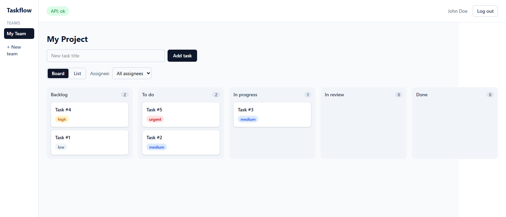

# Taskflow

Taskflow is a project management application for teams, with authentication, team workspaces, projects, and a Kanban board for task tracking.

**Live demo:** https://taskflow-bay-five.vercel.app  ·  **API docs:** https://ejacode-taskflow-api.hf.space/docs

> The demo is hosted on free tiers, so the first request after an idle period may take a few seconds while the services wake up.

## Features

* Authentication with registration, login, and JWT sessions
* Team workspaces with owner, admin, and member roles
* Projects scoped to a team
* Tasks with status, priority, assignee, due date, and description
* Kanban board with drag and drop ordering
* List view with sorting and status filters
* Toast notifications for success and error states

## Tech Stack

**Frontend:** React, TypeScript, Vite, Tailwind CSS v4, TanStack Query, React Router, dnd-kit

**Backend:** FastAPI, SQLAlchemy 2.0, Alembic, Pydantic v2, PyJWT

**Database:** PostgreSQL in production, SQLite for local development

**Tooling:** pnpm, Ruff, Black, mypy, pytest, ESLint, Prettier, Vitest, GitHub Actions

## Architecture

~~~mermaid
flowchart LR
    Browser --> Web["Vercel (React SPA)"]
    Web --> API["Hugging Face (FastAPI)"]
    API --> DB["Neon (PostgreSQL)"]
~~~

## Getting Started

### Prerequisites

* Python 3.11 or newer
* Node.js 20 or newer
* pnpm 10 or newer

### Backend

~~~bash
cd backend
python -m venv .venv
source .venv/bin/activate
# Windows: .\.venv\Scripts\Activate.ps1
pip install -e ".[dev]"
alembic upgrade head
uvicorn app.main:app --reload
~~~

The API runs at http://localhost:8000 with interactive docs at /docs. Local development uses SQLite, so no environment configuration is required.

### Frontend

~~~bash
cd frontend
pnpm install
pnpm dev
~~~

The app runs at http://localhost:5173 and targets http://localhost:8000 by default. Set VITE_API_BASE_URL to point at a different API (see frontend/.env.example).

## Testing

~~~bash
# Backend
cd backend && pytest

# Frontend
cd frontend && pnpm test
~~~

## Project Structure

~~~text
taskflow/
  backend/    FastAPI application, models, migrations, and tests
  frontend/   React single page application
  .github/    CI workflows
~~~

## Deployment

The frontend is deployed to Vercel, the API to a Hugging Face Docker Space, and the database is hosted on Neon. The API reads its configuration from the DATABASE_URL, SECRET_KEY, and CORS_ORIGINS environment variables.

## License

Released under the MIT License. See [LICENSE](LICENSE).
